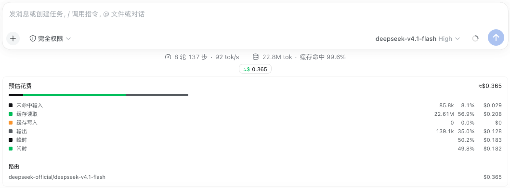
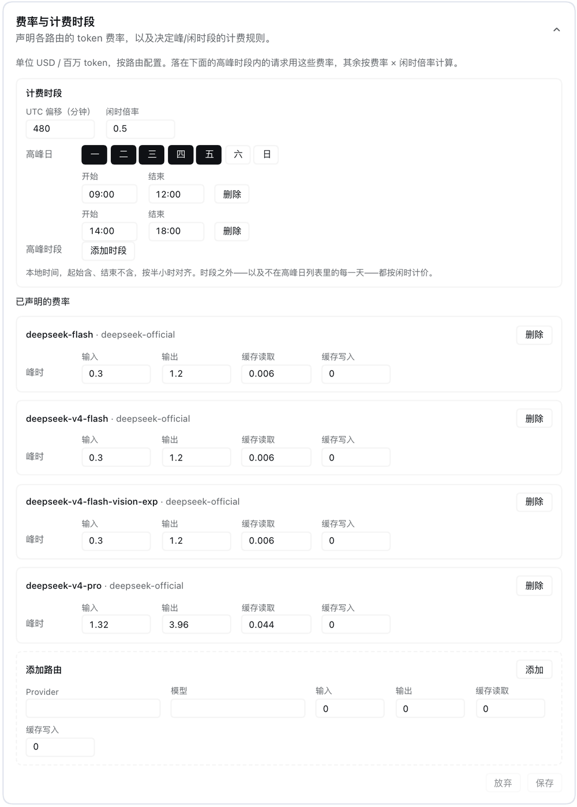

# dsh-plugin-token-cost

**English** · [简体中文](./README.zh-CN.md)

Estimated session spend for DeepSeek Harness, priced by **peak and off-peak
rates**: every attempt is charged at the rate set that was in force when it
happened, not at whatever the rate happens to be when you read the total.

## What it contributes

| Contribution | Kind | Where it shows |
| --- | --- | --- |
| `tokenCostEstimate` | host session projection (client-visible) | read by the pill through `useProjection` |
| `token-cost` | host row config (volatile `rates` / `schedule` / `currency`) | the profile's `cordis.patch.yml`, written by the card |
| composer pill | browser `conversation.composer.dock` entry | under the composer, beside the shipped stats pills |
| `Token rates` card | browser `plugins.row.config` entry keyed `dsh-plugin-token-cost#token-cost` | Plugins → this bundle → its `token-cost` row |

The pill shows `≈$0.0123`, or `≈¥0.0873` once another display currency is
declared. Clicking it expands a panel with the four priced usage buckets (tokens,
share of the priced total, the amount in the display currency, and a composition
strip), the peak/off-peak split for the configured schedule, and one row per
route. A route with no declared rates renders as `unpriced` and contributes
nothing to the total — unpriced is never reported as free.

Opening the Plugins page, this bundle, and then its `token-cost` row shows the
card as one collapsed row on the row's page: a title and description that open in
place, a header mark while edits are staged, and one footer save that writes the
display currency, the rate table and the schedule together in a single
revision-fenced mutation. A confirmed save collapses the card again. The card is
the row's whole configuration surface: the schema-derived page is switched off
for this entry, so there is exactly one place to edit it.

## What it looks like





## Install

From the git repository:

```sh
dsh plugin --profile web add github:GG-Features/dsh-plugin-token-cost
```

From a checkout you already have, or from a packed tarball (for example one
attached to a release):

```sh
dsh plugin --profile web add /path/to/dsh-plugin-token-cost
pnpm pack
dsh plugin --profile web add ./dsh-plugin-token-cost-0.2.0.tgz
```

Once the package is on the registry, the shortest form is:

```sh
dsh plugin --profile web add dsh-plugin-token-cost
```

Then restart the profile. The bundle layer inserts the `token-cost` row, the host
half registers the projection and declares the row's volatile configuration, and
the browser half is served through the client module registry: it rides the
shell's combined `/plugins/??<pkg>/client.js,…` request under the package name,
so a bare GET of `/plugins/dsh-plugin-token-cost/client.js` answers 404.

The package ships plain JavaScript — an ESM host entry and a hand-written
module-factory browser bundle — so **no build step runs** in any of those forms. A
git install fetches sources rather than artifacts, and pnpm ≥10 normally asks the
user to allow a dependency's build scripts; this package declares no `prepare` or
`postinstall` script, so there is nothing to allow.

## Quick start

The plugin ships the **official DeepSeek table** as the base layer of its
`token-cost` row, so a fresh install prices the official routes with no further
setup: peak USD per million tokens, off-peak at half, on DeepSeek's own peak
hours. A route the table does not name — another provider, or a proxy with its
own ids and prices — renders as `unpriced` and leaves the pill at `≈$—` until it
is declared. Rates resolve in either of two places, or in both:

1. **The composition base** — the `config` of the `token-cost` row, shipped with
   that official table and the right home for values a deployment wants under
   version control:

   ```yaml
   - insert:
       - id: token-cost
         name: dsh-plugin-token-cost
         config:
           schedule:
             utcOffsetMinutes: 480        # Beijing
             peakDays: [1, 2, 3, 4, 5]    # ISO weekdays: 1 = Monday … 7 = Sunday
             peakWindows:
               - { startMinutes: 540, endMinutes: 720 }     # 09:00–12:00 local
               - { startMinutes: 840, endMinutes: 1080 }    # 14:00–18:00 local
             offPeakMultiplier: 0.5
           rates:
             - provider: deepseek-official
               model: deepseek-v4.1-flash
               input: 0.3
               output: 1.2
               cacheRead: 0.006
               cacheWrite: 0
           # Optional: show amounts in yuan. See "Display currency".
           currency: { code: CNY, symbol: ¥, rate: 7.1 }
   ```

2. **The user layer** — the Settings card, stored as the `token-cost` row's
   `config` in the profile's `cordis.patch.yml`. It wins field by field over the
   base, and clearing a field in the card restores the base value. Because a
   Cordis config patch replaces a row's whole `config`, a save stores the
   composed values plus every volatile field, so later changes to the shipped
   table do not reach this profile until the row's config override is removed.

The shipped table is `cordis.patch.yml` in this package — the bundle layer that
inserts the row — and its prices come from
<https://api-docs.deepseek.com/quick_start/pricing/> (USD per million tokens; the
Chinese page quotes 元). It names the catalog's own ids for the
`deepseek-official` route, so it prices the official endpoint and nothing else:
prices move at the provider, so a deployment that needs exact numbers overrides
this config in its own patch layer.

## Declaring rates

Three sources, resolved in this order:

1. The user layer (the card).
2. The composition base (the row's `config`).
3. The adapter's own declaration — `llm.modelCost(provider, model)` when the
   deployment's provider adapter declares one. Read-only here, and only for
   routes the table does not cover.

A rate entry is one route with its four peak rates:

```yaml
- id: token-cost
  config:
    rates:
      - provider: deepseek-official
        model: deepseek-v4.1-flash
        input: 0.3
        output: 1.2
        cacheRead: 0.006
        cacheWrite: 0
```

All four are required and are USD per million tokens, matching the four disjoint
buckets of the provider's reported usage; the display currency changes what an
amount reads as, never what a rate means. The schema refuses a rate below zero,
and a card write states the same requirement in the browser before the write
leaves it. An unknown key on a rate entry is inert rather than refused: the
schema passes it through and both halves read the six declared fields only.

### The pricing schedule

```yaml
- id: token-cost
  config:
    schedule:
      utcOffsetMinutes: 480        # local offset the windows are read in
      peakDays: [1, 2, 3, 4, 5]    # ISO weekdays; 1 = Monday … 7 = Sunday
      peakWindows:
        - { startMinutes: 540, endMinutes: 720 }     # 09:00–12:00 local
        - { startMinutes: 840, endMinutes: 1080 }    # 14:00–18:00 local
      offPeakMultiplier: 0.5
```

An attempt is **peak** when its local weekday is in `peakDays` *and* its local
time of day falls inside one of `peakWindows` (start inclusive, end exclusive,
each 0..1440). Every other attempt — other hours, other days, weekends — is
**off-peak** and priced at the peak rate scaled by `offPeakMultiplier`. Omitting
`schedule` prices everything at the peak rates. The schema requires at least one
peak day, at least one window per day, an offset within ±1440 minutes and a
multiplier between 0 and 1, and the card refuses to write a windowless schedule
at all, so a schedule that could never mark an hour as peak is never stored.

The discount is one multiplier on purpose: four flat rates plus a factor cannot
drift out of the 1:2 relationship a flat off-peak discount requires, and a
per-bucket off-peak table would be a second thing to keep in sync.

## Display currency

Amounts are priced in USD and shown converted. `currency` says what the browser
half prints in front of an amount and what one USD is worth in it:

```yaml
- id: token-cost
  config:
    currency:
      code: CNY     # the label the switch marks as current
      symbol: ¥     # the text in front of an amount
      rate: 7.1     # display units per 1 USD
```

The field is display-only. The projection, its persisted checkpoint and every
priced total stay USD, so choosing another currency never reprices a session,
invalidates a stored estimate, or changes what a route costs — only the text a
number becomes. `rate: 1` reads every amount as plain US dollars, which is the
default when no `currency` is declared.

Nothing here is fetched. `rate` is a number you maintain, exactly like the rate
table beside it: the presets ship `1 USD = 7.10 CNY`, `0.92 EUR`, `0.79 GBP`,
`7.80 HKD` and `155 JPY` as starting points, and a stale one shows a stale
amount. Pick the value you are billed at.

The Settings card carries a **Display currency** block: one preset per offered
currency, each staging its code, its symbol and its rate, plus code, symbol and
rate fields for anything else. The pill's breakdown panel carries the same
presets as one-click chips for a reader who only wants to see yuan, writing the
same field without opening Settings.

## How the estimate is computed

- The host folds `assistant/message` usage per route into a histogram of the 48
  half-hours of a **UTC weekday** (336 slots), keyed by the event's durable
  `time`. Two rules match the shipped token meter: a repeated settlement of one
  turn/step replaces its earlier sample (in its own slot), and
  `llm/retry-started` closes that scope so a retry contributes another attempt.
  The route comes from the attempt's own assembled message, falling back to the
  newest `request/header`; an attempt with no known route stays unrecorded.
- The schedule is applied to those slots when the view is produced: the offset
  shifts a slot's UTC weekday, which can move it into the neighbouring local
  weekday, and only then are the peak days and windows evaluated. An attempt that
  happened in an off-peak hour stays off-peak no matter when the estimate is
  read, and a session spanning the boundary prices each attempt with its own rate.
- Neither the rates nor the schedule are folded into the state: editing either
  one reprices the complete durable log at the next read with no state version
  bump and no checkpoint invalidation.
- The browser re-prices from the published histograms and the live config form
  — rates *and* schedule — whenever the table covers every route with usage and
  the view carries the histogram basis this bundle understands. A partial table,
  or a host half publishing another basis, leaves the host view untouched: the
  host also prices adapter-declared rates the browser cannot see.

## Compatibility

- Written against **dsh 0.1.7-rc.1**.
- 0.2.0 is the 0.1.7 port. The configuration's owner became the row's own Cordis
  `Config` (three `.volatile()` fields, read through each reference's `get()`),
  the card moved from the removed `settings.plugin.item` slot to this row's
  `plugins.row.config` page, and the browser half reads and writes the shared
  form through `ctx.configForms.get('token-cost')` instead of the removed
  `ctx.settingsScope.bind`. On 0.1.6 and earlier this version cannot work: the
  browser half's `configForms` injection never resolves and the Web UI refuses to
  finish booting. Use 0.1.0 there.
- It builds only on public — but pre-stable — extension points:
  `ctx.sessionProjections.register`, a plugin `Config` with `.volatile()` fields,
  `ctx.settings.configure({ auto: false })` behind an optional `ctx.inject`,
  `ctx.configForms.get(<entry id>)` with its `getSnapshot` / `subscribe` /
  `mutate`, the `plugins.row.config` and `conversation.composer.dock` slots,
  `SessionEvent.time`, `assistant/message` usage, and `llm/retry-started`. A
  release that changes any of them may need a matching plugin release.
- The projection key is `tokenCostEstimate`, deliberately not `tokenCost`:
  `@deepseek-ai/dsh-token-meter` owns that key, and a second registration of an
  existing key defers to the first instead of failing, which would look like a
  plugin that mounted and did nothing.
- `view.slotBasis` names how to read the histograms, so a browser half reloaded
  ahead of the host module refuses the mismatch and shows the host's own numbers
  instead of mispricing them.

## Known limitations

- **Half-hour granularity.** A window boundary that is not a multiple of 30
  minutes rounds down to the slot containing it, and an attempt is attributed to
  the slot its message was committed in.
- **Rates are not fetched from anywhere.** Everything here is what you declared:
  a provider price change is a table edit, not an automatic update. (Some other
  cost plugins sync official prices on a schedule.)
- **The display rate is not fetched either.** `currency.rate`, including every
  preset's, is a number you maintain: nothing here reads an exchange rate, and
  the card cannot tell a stale one from a fresh one.
- **A host-half change needs a profile restart.** A profile's live reload applies
  configuration only, so editing `index.js` while the profile runs changes the
  row's config but not the loaded module. `client.js` is different: the client
  module registry re-snapshots it and the browser hot-swaps it.
- **The estimate is an estimate.** Retried requests are billed again, and
  provider-side rounding, tiered rates beyond one peak/off-peak pair, and
  promotional discounts are outside what one rate set plus one multiplier express.
- **The browser half is hand-written.** There is no build step: `client.js` is
  written directly in the module-factory format the client module registry
  consumes, and it injects its stylesheet with `document.createElement('style')`
  rather than CSS Modules.
- **Copy lives in `client.js`**, as two dictionaries registered on the client
  locale service (English and Chinese).

## Development

```sh
pnpm install
pnpm test
```

- `test/host.test.mjs` — the fold, the schedule, the pricing, a live volatile
  edit repricing the next read, the display currency's defaults and refusals, and
  the schema refusals. Runs on `node --test` with no test-only dependencies.
- `test/client.test.mjs` — the card's disclosure behaviour (collapsed, open,
  staged edits, one footer save, discard, auto-collapse, the windowless-schedule
  refusal), its one-liner view, its currency switch, and the pill's pricing and
  formatting, mounted in jsdom with React Testing Library.

### Panel layout

The pill's breakdown is **one CSS grid owned by the panel**: each row is a
`display: contents` box whose cells declare their own column, so the token,
share and USD columns share a single geometry and every figure lines up whatever
its width. A grid per row cannot do that — an `auto` track is sized by the row's
own content, so the money column drifted by up to 54px between the buckets, the
peak/off-peak split and the routes. A route row spans the label columns and
leaves the money column to the USD, which is the panel's right edge and therefore
where the header total already sits. Cells are emitted in ascending column order,
which is what sparse auto-placement needs to keep a row's cells on one grid row;
`test/client.test.mjs` pins both halves of that contract.

A local `link:` install resolves `@deepseek-ai/schemastery` from this directory's
own `node_modules`, because a linked package resolves its imports from its real
path rather than from the profile. A registry or tarball install resolves the
declared dependency normally.

## License

MIT
